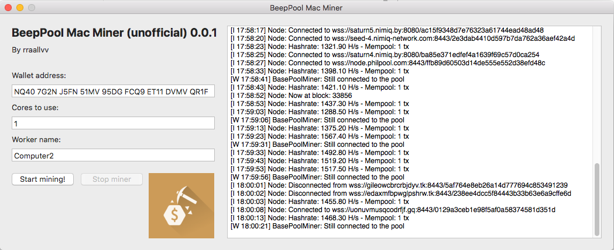

# BeepPool-Miner
A small GUI for entering the required parameters for starting the miner for BeepPool

BeepPool Windows Miner, based on the packages provided by Beep on: https://beeppool.org/downloads.html

This is a GUI for entering your wallet, set the amount of cores you want to use and give the worker a name. The miner can then be viewed and handled inside the GUI. The miner itself is made by others in the Nimiq-community and not by me.

## Windows

Download .zip, unzip and start BeePool-Windows-Miner.exe. Enter your settings and hit the start mining button and that's it. On restart your settings will be pre-filled.

Requirements: .NET Framework 4.6 or newer

## macOS

Download .zip, unzip and open BeePool-Mac-Miner.app. Enter your settings and hit the start mining button and that's it. The first time it will ask for the path to miner executable. On restart your settings will be pre-filled.

## Beer funds 😁
Windows version: *NQ78 BH7J NYMJ 0G1F 3DLP LFC4 DULQ AEH9 H7GM*  
macOS version: *NQ40 7G2N J5FN 51MV 95DG FCQ9 ET11 DVMV QR1F*
