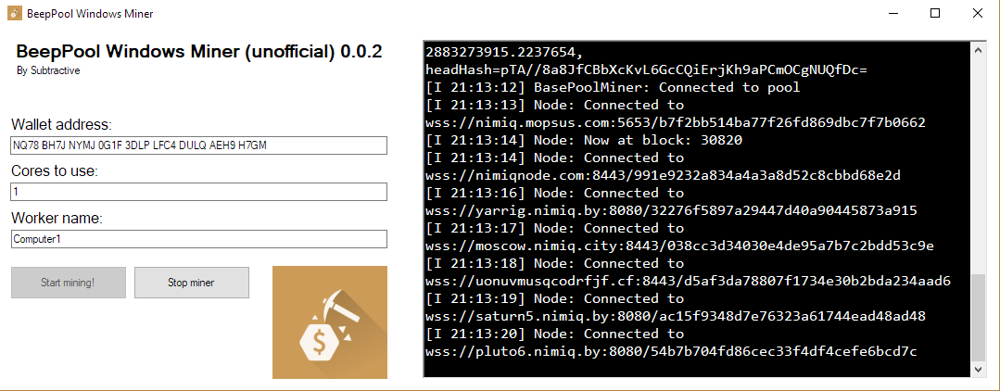

# BeepPool-Windows-Miner
A small GUI for entering the required parameters for starting the miner for BeepPool

Subtractive's BeepPool Windows Miner, based on the packages provided by Beep on: https://beeppool.org/downloads.html

This is a GUI for entering your wallet, set the amount of cores you want to use and give the worker a name. The miner can then be viewed and handled inside the GUI. The miner itself is made by others in the Nimiq-community and not by me.

Download .zip, unzip and start BeePool-Windows-Miner.exe. Enter your settings and hit the start mining button and that's it. On restart your settings will be pre-filled.

Requirements: .NET Framework 4.6 or newer
